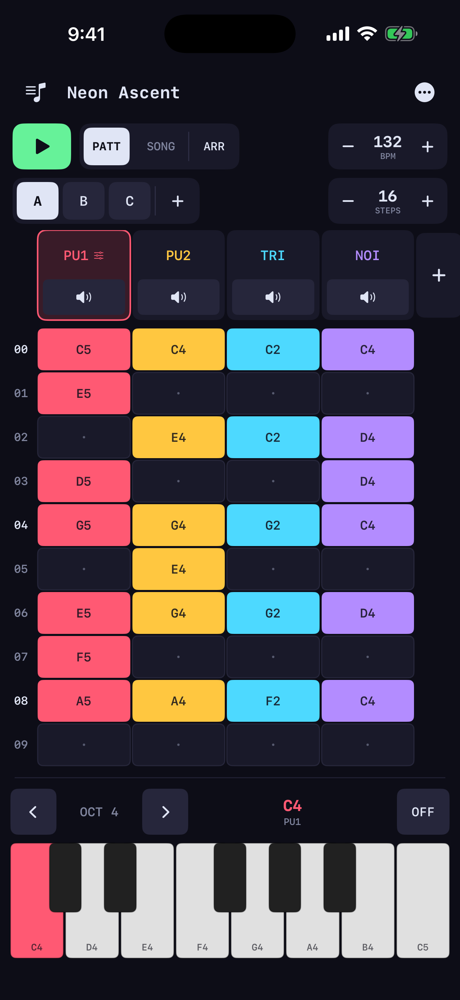
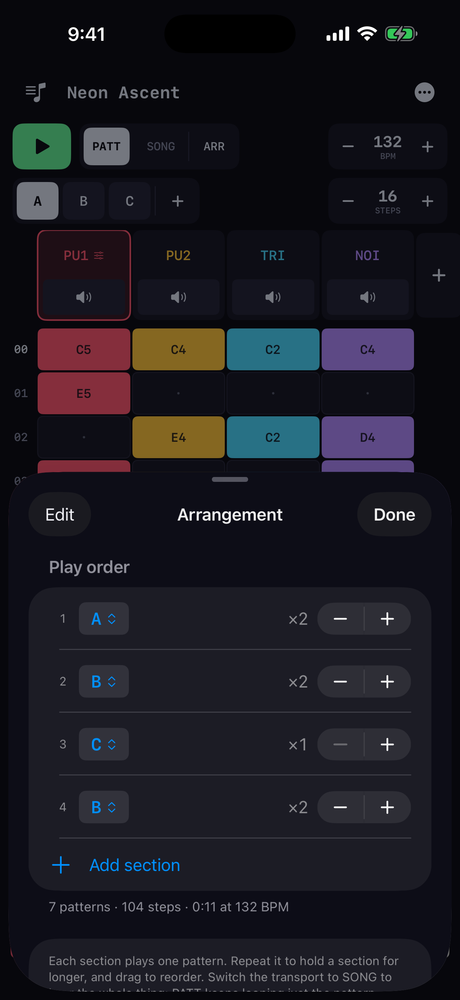
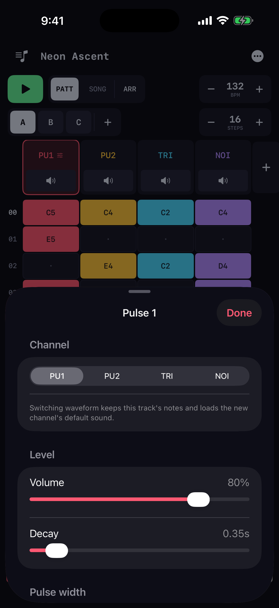
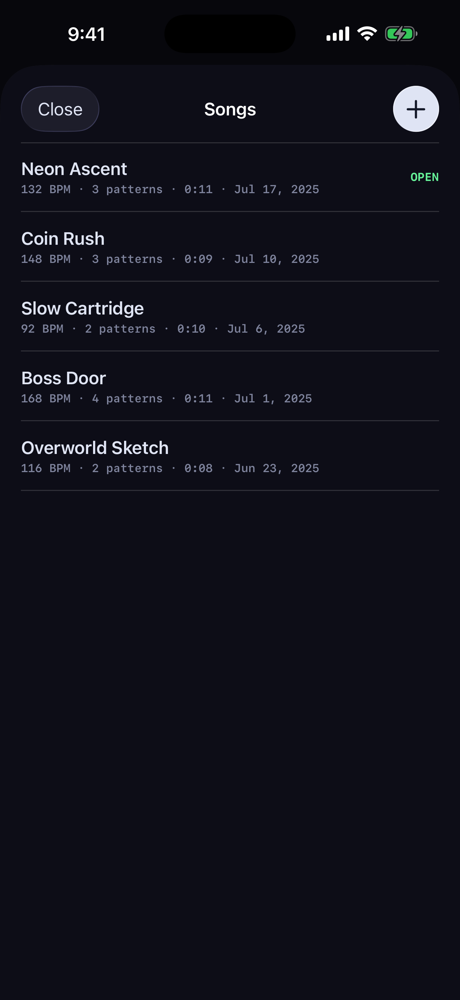

# Chiptune

A step sequencer for iOS that writes NES-style chiptune music. Every sound is
synthesized as you play it: four channels modeled on the NES, no samples, no
audio files anywhere in the app.

<p>
  
  
  
  
</p>

## Writing a song

You work at two levels. A **pattern** is a grid of steps and notes: pick a note
on the keyboard, tap a cell to place it, tap a filled cell to clear it. A
pattern is 4 to 64 steps long, and patterns can differ in length.

An **arrangement** chains patterns into a full song. Each section names a
pattern and a repeat count, and the sections play in order, so a piece can have
an intro, a verse and a chorus rather than a single loop. `PATT` auditions the
pattern you're editing; `SONG` plays the whole arrangement.

Songs save as you work and the app reopens the last one you edited, with undo
and redo throughout. The library holds everything you've written. A song can
also be shared as a song file and imported on another device.

## Exporting

Any song exports to a WAV of the entire arrangement, played 1 to 16 times over.
There are two ways to end it:

- **Seamless loop:** the file is exactly that many passes long, and the last
  notes ring on into the start, so it loops with no gap. Best for dropping into
  a sampler, a DAW or a video.
- **Ring out:** the file plays on after the last pass until the final notes
  fade, so it ends like a finished track.

## The four channels

The layout follows the NES sound hardware:

- **Pulse 1 and 2:** square waves with selectable duty (12/25/50/75%)
- **Triangle:** quantized to 16 steps per half cycle, like the real channel
- **Noise:** a 15-bit shift register clocked at a multiple of the note
  frequency, so it comes out pitched rather than as flat hiss

Each track has its own volume, decay, pulse width and arpeggio, edited from the
column header. Presets such as Lead, Pluck and Echo give each channel a starting
sound, and every control stays adjustable after you pick one. **Hold** makes
a note sustain instead of decaying. A rest (note-off) cuts a sustaining note,
which matters most on the triangle, since it holds by default. Tracks can be renamed
and muted. When four channels aren't enough you can add tracks, up to eight in
all.

## iPad and hardware keyboards

The app runs on iPhone and iPad. On a landscape iPad the keyboard moves beside
the grid and the instrument editor docks under it, so the sound controls stay
open while you write.

With a hardware keyboard attached, the grid works like a tracker:

- Arrow keys move the cursor and Space plays or stops.
- The `A W S E D F T G Y H U J K` row enters notes, and `Z`/`X` change the octave.
- Delete clears a step. `\` arms a rest, like the REST key on screen, and
  Return writes whatever the on-screen keyboard has selected.

## How the synth works

`Sources/Audio/ChipCore.swift` is the whole engine: oscillators, amplitude
envelopes and the step sequencer, running inside an `AVAudioSourceNode` render
callback.

The design rule is that the audio thread never allocates, locks, or triggers a
copy-on-write. Every pattern in the song, the flattened play order, and the
per-channel parameters live in manually allocated buffers. The main thread
writes into them field by field; each field is word-sized and independently
meaningful, so a torn read is impossible and a stale read is harmless (it lasts
one buffer at most). Following an arrangement then costs the audio thread one
index lookup at each pattern boundary and never a hop back to the main thread.

Two details that make it sound right:

- **Retriggering.** Playing a voice that is still ringing doesn't restart it on
  the spot. The envelope ramps down over ~2.5 ms, then the new note ramps up
  over ~1.2 ms. Snapping the level and phase back to zero mid-ring is a step
  discontinuity, which is what a run of the same note used to sound like.
- **Master chain.** A gentle lowpass, a ~10 Hz DC blocker (narrow pulse duties
  are strongly asymmetric and would otherwise eat headroom and click), and a
  `tanh` soft clip.

`Sources/Audio/WavExport.swift` drives the same core offline, so an exported
file is sample-identical to what you hear in the app.

## Building

Needs iOS 17+, Xcode 16, and [XcodeGen](https://github.com/yonaskolb/XcodeGen).
The Xcode project is generated from `project.yml`, so it isn't checked in.

```sh
brew install xcodegen
xcodegen generate
open Chiptune.xcodeproj
```

The simulator needs no signing team. To build to a device, set
`CHIPTUNE_TEAM_ID` before generating and it's baked into the project.

## License

MIT. See [LICENSE](LICENSE).
